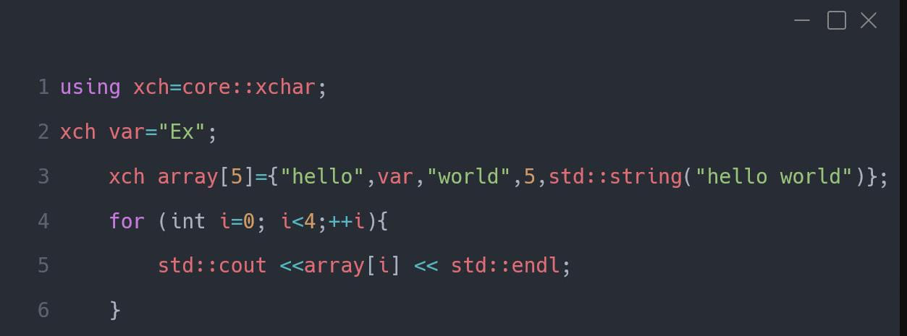

**Multipurpose library.**
### Usage
*download it from **github.com/** or do a git clone 

```bat
  git clone --recursive https://github.com/yuI4140/xore.git 
```
*and include in your project.*
## Features ↹↔
### xchar class
*class that serves as an alternative to the built-in (const char) data type offering a variety of functions* *and transformations for (const char) and (char) data typess.*
#### Example:

### Matrix class
